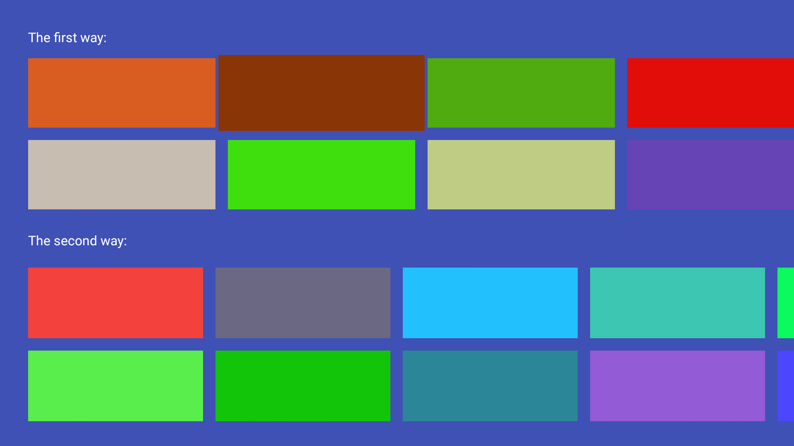
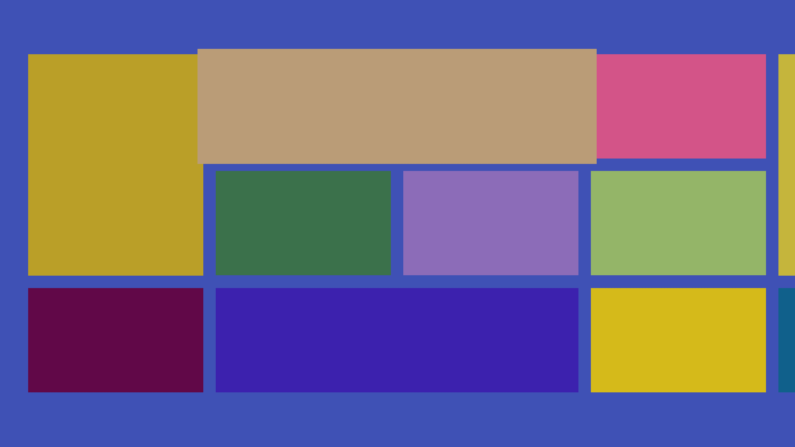

# TvRecyclerView
A custom RecyclerView for Android TV end, It can implement grid and irregular grid two display types.

## ScreenShot
<p>

<br/>
<br/>

</p>

## Usage
1.First you can add gradle dependency with command :
```groovy
dependencies {
    ......
    compile 'com.henryblue.library:tvrecyclerview:1.2.4'
   }

```
To add gradle dependency you need to open build.gradle (in your app folder,not in a project folder) then copy and add the dependencies there in the dependencies block;

2.Add HorizontalGridView in your layout
```
<app.com.tvrecyclerview.HorizontalGridView
        android:id="@+id/id_grid_first"
        android:layout_width="match_parent"
        android:layout_height="wrap_content"
        android:paddingLeft="45dp"
        android:paddingRight="45dp"
        android:paddingTop="20dp"
        android:clipChildren="false"
        android:clipToPadding="false" />
```
3.Set the presenter(adpter create child view)
```
public class RegularPresenter extends Presenter {
    RegularPresenter(Context context) {
        super(context);
    }
    @Override
    public View onCreateView() {
        ImageView view = new ImageView(getContext());
        view.setSelected(true);
        view.setFocusable(true);
        view.setLayoutParams(new ViewGroup.LayoutParams(423, 138));
        return view;
    }

    @Override
    public void onBindViewHolder(ViewHolder viewHolder, Object item) {
        viewHolder.view.setBackgroundColor(Color.GREEN);
    }

    @Override
    public void onUnbindViewHolder(ViewHolder viewHolder) {
    }
}
```

4.Set GridObjectAdapter
```
HorizontalGridView gridView = findViewById(R.id.id_grid_first);
gridView.addItemDecoration(new SpaceItemDecoration());
gridView.setNumRows(2);
GridObjectAdapter adapter = new GridObjectAdapter(new RegularPresenter(this));
gridView.setFocusZoomFactor(FocusHighlightHelper.ZOOM_FACTOR_SMALL);
gridView.setAdapter(adapter);
for (int i = 0; i < 10; i++) {
  adapter.add(new RowItem());
}
```
<font size=4>For more usage, please refer to the examples in the code. For example how to implement irregular style, please refer [**here.**](https://github.com/henryblue/TvRecyclerView/tree/master/app/src/main/java/com/app/tvrecyclerview/irregular)<font>

## XML attributes


| Name | Type | Default | Description |
|:----:|:----:|:-------:|:-----------:|
|android:gravity|enum|Gravity.TOP&Gravity.LEFT| Set the way to gravity (Works in regular mode) |
|focusOutFront|boolean|false| Allow DPAD key to navigate out at the front of the View |
|focusOutEnd|boolean|false|Allow DPAD key to navigate out at the end of the view|
|numberOfRows|integer|1| set the number of rows in the HorizontalGridView (Works in regular mode) |
|numberOfColumns|integer|1| set the number of columns in the VerticalGridView (Works in regular mode) |

## Public Methods


## License
```
Copyright 2016 henryblue

Licensed under the Apache License, Version 2.0 (the "License");
you may not use this file except in compliance with the License.
You may obtain a copy of the License at

http://www.apache.org/licenses/LICENSE-2.0

Unless required by applicable law or agreed to in writing, software
distributed under the License is distributed on an "AS IS" BASIS,
WITHOUT WARRANTIES OR CONDITIONS OF ANY KIND, either express or implied.
See the License for the specific language governing permissions and
limitations under the License.

```